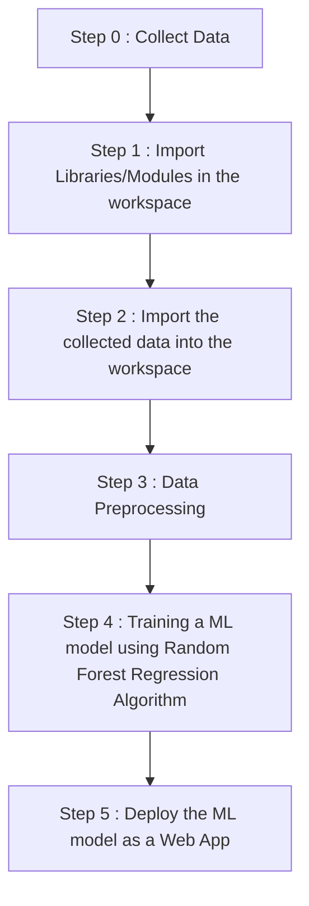

# Medical-Insurance-Cost-Predictor
This is a medical insurance cost predictor machine learning project using Random forest regressor


---

## Features

- Predict medical insurance costs based on user input (age, BMI, region, etc.).
- Uses **Random Forest Regression** for high accuracy predictions.
- User-friendly web app for real-time predictions using **Streamlit**.

---

## Dataset

- **File**: `insurance.csv`
- Contains the following features:
  - **`age`**: Age of the individual
  - **`sex`**: Gender of the individual
  - **`bmi`**: Body Mass Index
  - **`children`**: Number of children covered by health insurance
  - **`smoker`**: Smoking status
  - **`region`**: Residential region
  - **`charges`**: Medical insurance costs (target variable)

---

## Requirements

Install the required Python packages using the following command:
    ```bash
    pip install -r requirements.txt

## Key Dependencies

- `numpy==1.21.4`
- `pickle-mixin==1.0.2`
- `streamlit==1.2.0`
- `scikit-learn==1.0.1`

---

## File Structure

- **`insurance.csv`**: Dataset for training the model.
- **`Medical_Insurance_Cost_Prediction.ipynb`**: Jupyter Notebook for training and evaluating the model.
- **`medical_insurance_cost_predictor.joblib`**: Pre-trained Random Forest Regressor model.
- **`Medical_Insurance_Cost_Prediction_Web_App.py`**: Streamlit app script for deploying the prediction model.
- **`requirements.txt`**: List of required dependencies.

---

## Setup and Usage

### 1. Clone the Repository
    ```bash
    git clone https://github.com/your-username/Medical-Insurance-Cost-Predictor.git
    cd Medical-Insurance-Cost-Predictor

### 2. Install Dependencies
    ```bash
    pip install -r requirements.txt

### 3. Train the Model (Optional)
- Run the Jupyter Notebook to train the model:
    ```bash
    jupyter notebook Medical_Insurance_Cost_Prediction.ipynb

### 4. Run the Web Application
- Launch the Streamlit app to make predictions:
    ```bash
    streamlit run Medical_Insurance_Cost_Prediction_Web_App.py
- Access the app at http://localhost:8501.

---

## Roadmap

- Incorporate additional features for prediction, such as medical history.
- Optimize the model using advanced hyperparameter tuning.
- Enhance the web app with more interactive features.

---

## License

This project is licensed under the [MIT License](LICENSE).

---

## Acknowledgments

Special thanks to:

- **Kaggle Datasets** for providing the insurance dataset.
- **Streamlit** for enabling a seamless web app deployment.
- **Scikit-learn** for robust machine learning tools.

---

## Credit

Developed and maintained by **Shah Humayun Bashir**. Feel free to reach out for suggestions or contributions.

---

<h1 align='center'> WORKFLOW OF PROJECT </h1>



    


